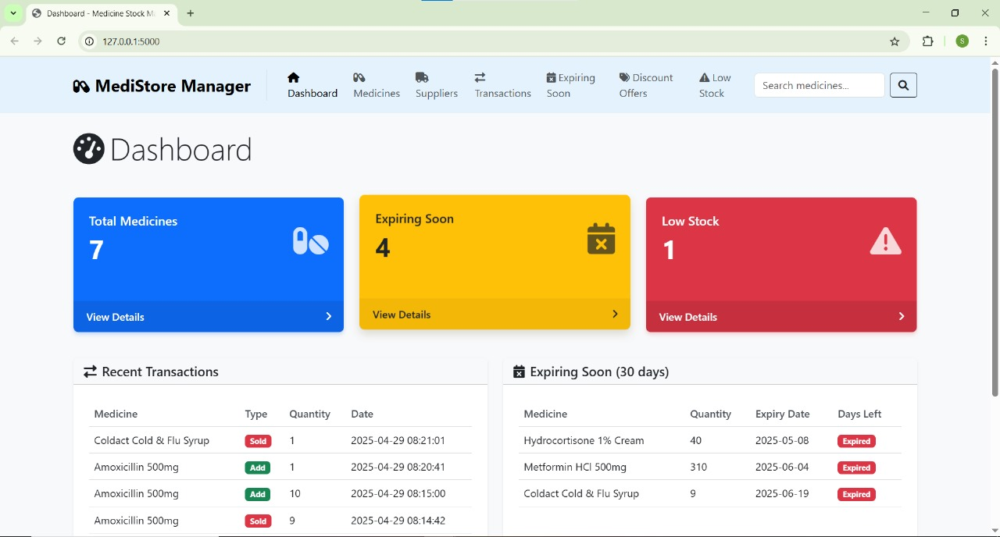
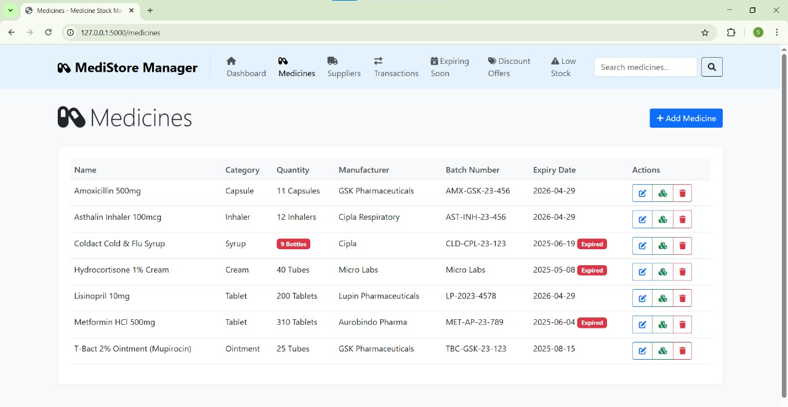
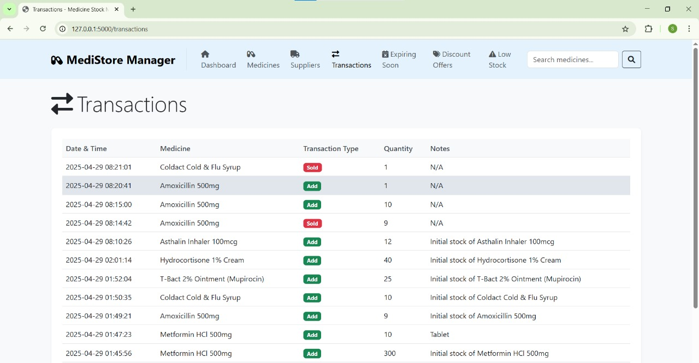
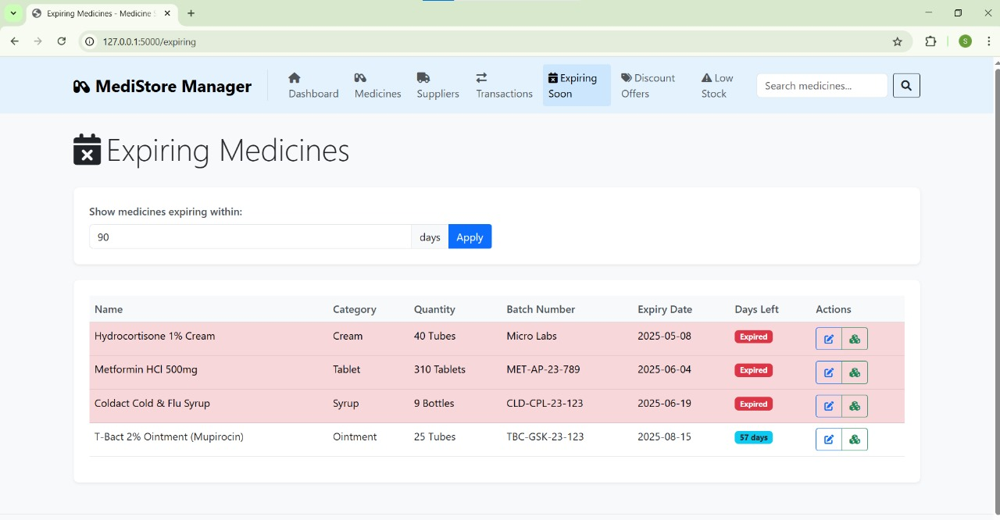
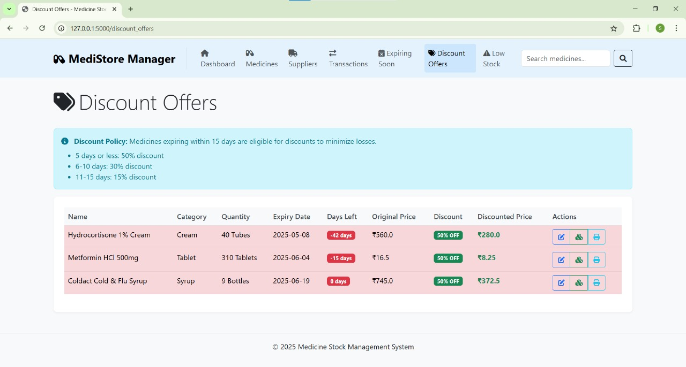
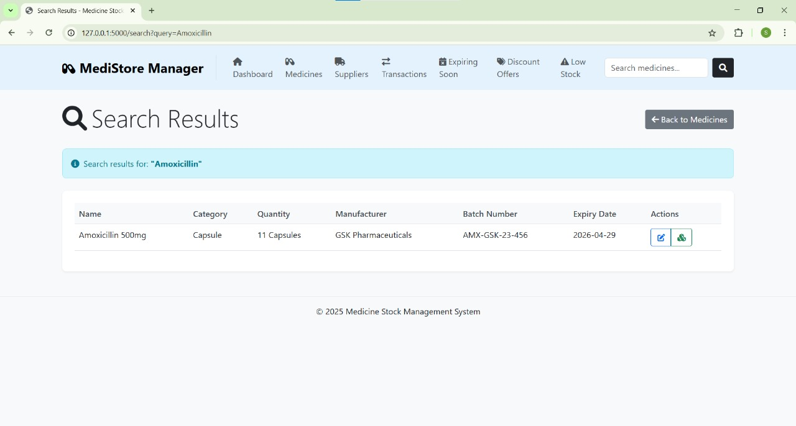

# MediStore Manager

A comprehensive web application for managing medicine inventory, tracking expiry dates, and optimizing stock levels in pharmacies and healthcare facilities.

## 📋 Features

- *Dashboard Overview*: Quick view of total medicines, expiring items, and low stock alerts
- *Medicine Management*: Add, edit, and delete medicine records with detailed information
- *Stock Tracking*: Monitor current stock levels and update quantities
- *Expiry Date Monitoring*: Track medicines nearing expiration with customizable time frames
- *Transaction History*: Complete log of all stock additions and removals
- *Supplier Management*: Maintain a database of medicine suppliers with contact information
- *Low Stock Alerts*: Identify medicines that need to be restocked
- *Discount Offers*: Automatically calculate recommended discounts for soon-to-expire medicines
- *Search Functionality*: Quickly find medicines by name, description, category, or manufacturer

##  View the page

## 💻 Technologies Used

- *Backend*: Python, Flask
- *Database*: SQLite
- *Frontend*: HTML, CSS, JavaScript, Bootstrap 5
- *Icons*: Font Awesome

## 📊 Database Structure

The application uses SQLite with the following main tables:

1. *medicines*: Stores medicine details including name, description, quantity, expiry date, etc.
2. *suppliers*: Contains supplier information
3. *transactions*: Records all stock movements (additions and removals)

## 📱 Usage Guide

### Dashboard
- View key metrics and recent transactions
- Access quick links to main features

### Managing Medicines
- Add new medicines with complete details
- Update existing medicine information
- Track stock levels and expiry dates
- Delete medicines when needed

### Stock Operations
- Add stock when new inventory arrives
- Remove stock when medicines are dispensed
- View complete transaction history

### Expiry Management
- Monitor medicines nearing expiration
- Set up discount offers for soon-to-expire items
- Filter by different time frames (15, 30, 90 days)

### Supplier Management
- Maintain a database of all suppliers
- Store contact information for easy communication

## 🔍 Key Features in Detail

### Expiry Tracking
The system automatically calculates days remaining until expiration and categorizes medicines based on urgency.

### Discount Calculation
For medicines nearing expiration, the system recommends discount percentages:
- 50% discount for medicines expiring in 5 days or less
- 30% discount for medicines expiring in 6-10 days
- 15% discount for medicines expiring in 11-15 days

### Low Stock Alerts
Configurable thresholds to identify medicines that need to be restocked.

## 🛠 Customization

You can customize various aspects of the system:
- Expiry alert thresholds (default: 30, 90 days)
- Low stock thresholds (default: 10 units)
- Discount percentages for expiring medicines
